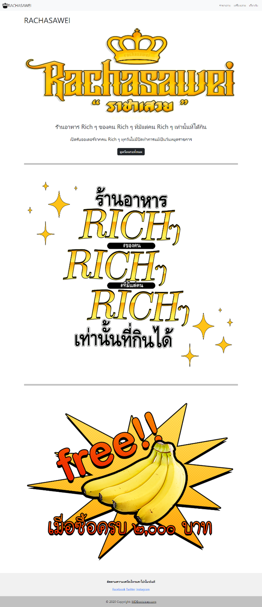
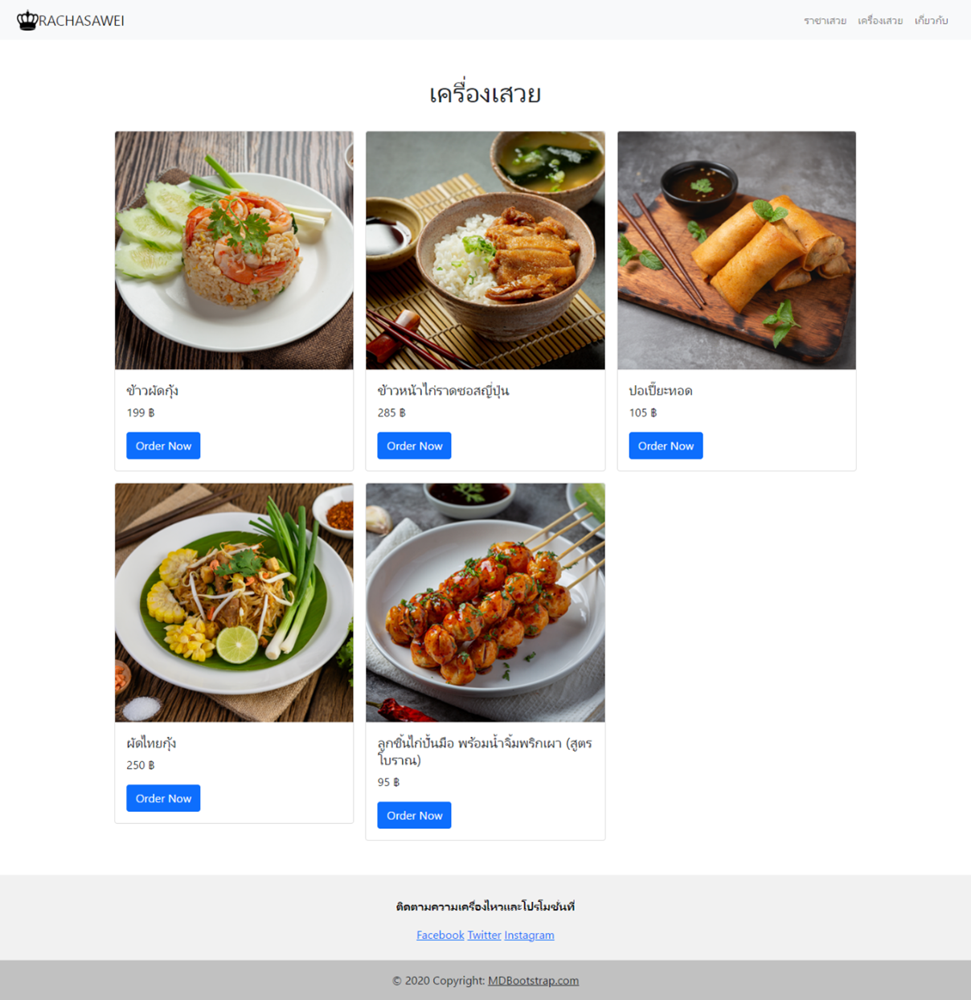
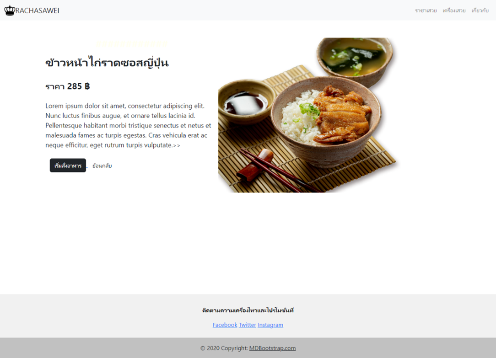
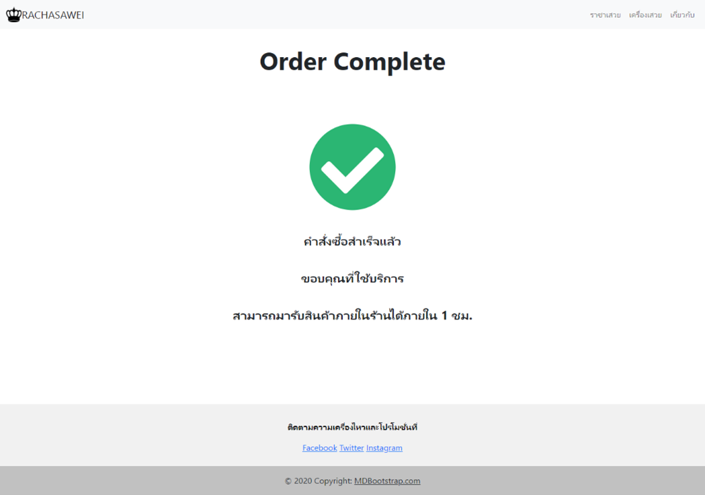

# Rachsawei_PHP_pj

## About the Project
Rachsawei_PHP_pj is an online shopping system developed using PHP and MySQL. It supports product management, shopping cart functionality, and payment processing. The user interface is built with HTML, CSS, and JavaScript.

## Key Features
- **Product Management**: Add, delete, and edit product details.
- **Shopping Cart System**: Add products to the cart, update quantities, and remove products.
- **Checkout System**: Supports order placement and payment confirmation.
- **User Management**: User registration and login.

## Project Structure
```
Rachsawei_PHP_pj/
│-- assets/              # CSS and JavaScript files
│-- img/                 # Images used in the website
│-- include/             # Reusable components such as Header, Footer
│-- register/            # User registration system
│-- upload_image/        # Image upload functionality
│-- _db_shoppingcart.sql # Database schema file
│-- about_us.php         # About Us page
│-- cart.php             # Shopping cart page
│-- checkout.php         # Checkout page
│-- index.php            # Homepage
│-- menu.php             # Main menu
│-- product-list.php     # Product listing page
│-- config.php           # Database connection settings
```

## Installation & Usage
1. **Clone the repository**
   ```bash
   git clone https://github.com/NannapatVis/Rachsawei_PHP_pj.git
   ```
2. **Set up the server**
   - Use XAMPP or MAMP to enable Apache and MySQL.
3. **Import the database**
   - Import `_db_shoppingcart.sql` into your MySQL database.
4. **Configure `config.php`**
   - Edit the `config.php` file with your database credentials.
5. **Run the project**
   - Open a web browser and go to `http://localhost/Rachsawei_PHP_pj/`
  
### Screenshots  
#### 🏠 Home Screen  
  

#### 📜 Menu Page  
  

#### 🔍 Menu Detail  
  

#### ✅ Order Complete  
  


## Technologies Used
- PHP
- MySQL
- HTML, CSS, JavaScript

---
If you encounter any issues or have suggestions, feel free to open an issue or submit a pull request on the [GitHub Repository](https://github.com/NannapatVis/Rachsawei_PHP_pj).

